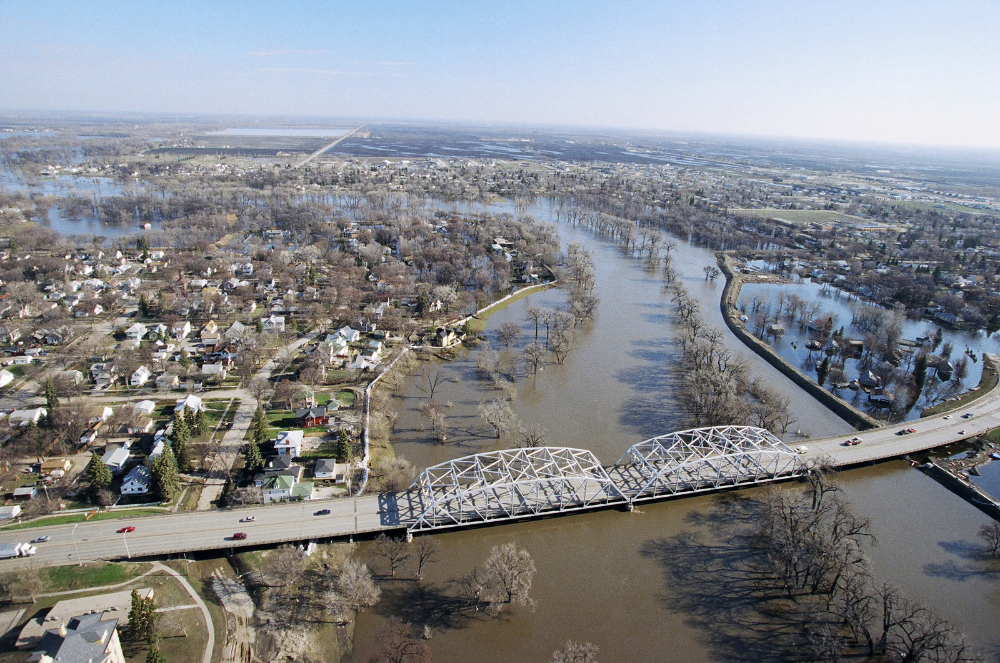

```{r setup, include=FALSE}
knitr::opts_chunk$set(echo = FALSE)
```

Flooding is one of the most costly and common types of natural disaster throughout the world. In the United States, over 90 percent of natural disasters involve flooding, and inflict more damage to both life and property than any other natural hazard.<sup>[(1)](https://www.dhs.gov/natural-disasters)</sup>



Because of this large hazard, it is is important to prepare for these flooding events ahead of time, to, for example, build structures such as levees and sandbag walls to reduce flooding risk, and to evacuate people and belongings from the potentially flooded area. While modern Numerical Weather Prediction models can predict weather accurately up about ten days in advance <sup>[(2)](https://www.dhs.gov/natural-disasters)</sup>, these weather models cannot predict the risk of flooding for weeks or months in advance. Ten days may not be enough to adequately prepare for major flooding, but multiple weeks, or even months, gives people more time to sufficiently prepare, and potentially safe lives and property.

Many different climate variables can influence weather in an area weeks or months in advance. For example, El Niño–Southern Oscillation (ENSO), a variation in sea surface temperatures in the tropical Western Pacific Ocean, can have significant impacts on the weather in the US. Generally, during warm, or El Niño events, the northern US has warmer and drier than usual weather, while the southern US has colder and wetter than usual weather. In cold, or, La Niña, events, the opposite generally happens. In cold or mountainous areas, snowpack is another important climate variable that impacts flooding, as snowpack builds for months, and melts later. We can feed this data into a machine learning model to predict how these events impact the probability and expected magnitude of flooding.

Feeding ENSO data into a machine learning model to predict flooding has been used with some success. The monthly flow of the Yangtze, China's longest river, was predicted in two major flood years and one minor flood year with good accuracy ($R^2$=0.8) using historical streamflow data, and ENSO data.<sup>[(3)](https://www.nature.com/articles/s41598-021-90964-3)</sup> Particularly, the ENSO data helped determine the timing and magnitude of the flooding event.

Through climatic variables and historical data, I will predict streamflows of rivers months in advance, and calculate the probability of exceeding flood stage, as well as the predicted maximum streamflow.