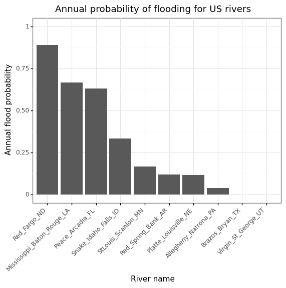
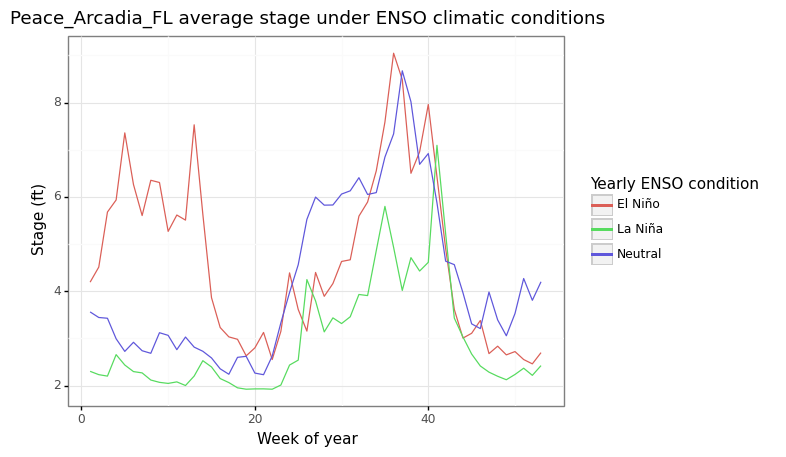
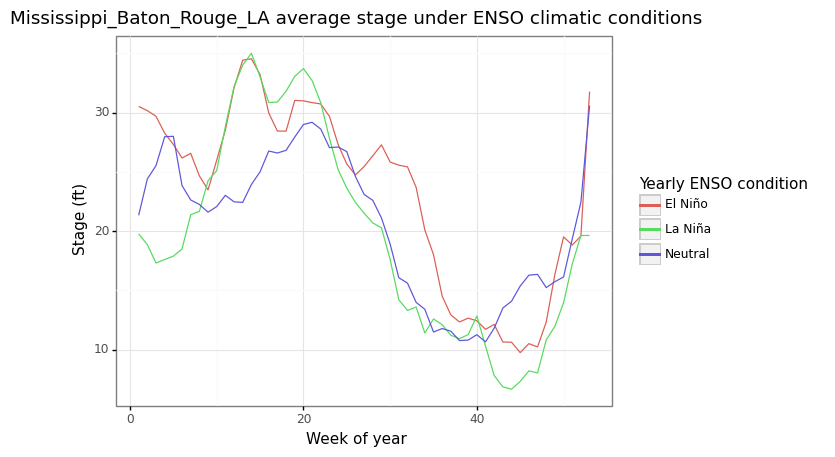

```{r setup, include=FALSE}
knitr::opts_chunk$set(echo = FALSE)
```

## The data

I have downloaded data for ten American rivers in different regions throughout the US, from the Midwest, the Northeast, the South, and the West. These rivers range in size from the wide Mississippi in Baton Rouge, LA, just around 200 miles from it's delta where it empties into the ocean, to the unassuming Peace in Arcadia, FL, lying just a few feet above sea level, to the Snake as it flows through the high Snake River Plain through Idaho Falls, ID.

I downloaded data for these rivers from the US Geological Survey (USGS). The USGS has many stations for monitoring the flow of hundreds of different rivers throughout the country, and the data for these rivers has been recorded for many years, offering a rich data set to pull from.

The USGS has records going back the furthest for river flow, with river water level, or gauge height, data either being only recent, or not existing at all. This presents a problem as the height of the river is necessary to determine if the river has flooded, as rivers generally have a certain flood stage height. The USGS helps us with this, as they provide what is known as a rating table, which gives an empirical relationship between the measured flow of the river, and the height of the river. I downloaded this data for each river also, and fit a cubic curve to the data in order to calculate the height from the river flow. The rating curves are smooth, simple, and monotonic, without significant irregularities, so a cubic curve does fit well to them.

One more source of data I pulled in was the Oceanic Niño Index, which is an index measuring sea surface temperature in the western tropical Pacific. These sea surface temperature anomalies can have significant effects on weather in many parts of North America, as well as throughout the world, especially in the winter season. The El Niño - Southern Oscillation (ENSO) weather pattern has been used to predict river flow in the past, for example, in the Yangtze River in China.

Another data source I am pulling in is the monthly ERA5 dataset, from the European Centre for Medium-Range Weather Forecasts (ECMWF), which has historical weather data, going back to the 1970s, for many different variables, such as temperature, precipitation, and snow depth. Particularly, I am interested in snow depth, as it can help predict spring flooding in snowy regions, as a high winter snowfall can cause flooding when the snow melts.

## Annual probability of flooding

One thing I discovered when looking at the different rivers, is that they have wildly different probabilities of flooding. Here is a chart:



## Correlation with ENSO

Different rivers in different regions are influenced in varying ways by the ENSO climate pattern. For example, in Florida, El Niño (above average sea surface temperatures in the tropical Pacific) events generally cause above average precipitation in the winter dry season, as can be seen in the river stage of the Peace River in Arcadia, FL:



A similar, but weaker pattern can be seen in Louisiana with the Mississippi River. This pattern may be weaker because the Mississippi River is fed by rivers in many different regions of the US, in which ENSO has different impacts on the weather.



## Missing data

Some rivers, such as the Red River in North Dakota, often has missing data during the winter, as ice obstructs the ability to measure the river flow accurately. Because of this missing data, I will not be predicting the stage on these seasonally ice covered rivers, and I will be predicting future river stage on rivers in warmer regions, that way the stage can be predicted year round, and not just outside of the winter. I have chosen to predict the Mississippi (Louisiana) and Peace (Florida) rivers as they have data available year round, and the river stage has generally good correlation with the ENSO climate pattern.