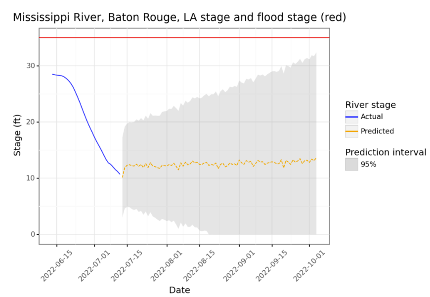
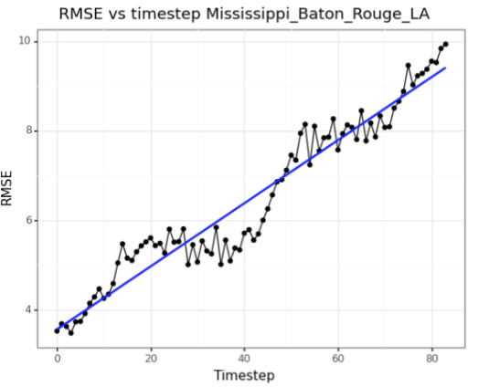

```{r setup, include=FALSE}
knitr::opts_chunk$set(echo = FALSE)
```

Time series forecasting is well know to be a difficult problem, and there are a few ways to go about it.

The first way is by making the time series data stationary. This means removing trends from the data, for example seasonal trends. One way to do this is to subtract the time series value from the median value it has on that day of the year. Another method is differencing, which means transforming the time series data into a difference from the last timestep.

One more method of time series forecasting is binning. Binning time series into groups, say by months, make turn the problem into more of a classic machine learning problem, as only a smaller number of these larger, binned timesteps need to be predicted. In my first models, I grouped data by month, and created lag and lead columns, and predicted a target column of whether the river would be flooded or not, with some success. However, this approach had disadvantages, as the very coarse grained data (on timescales of months) can miss out on trends that are present in more fine grained data (on the weekly to daily level). As such, I looked for a better alternative, one that predict each day, to produce fine grained forecasts usable in a dashboard.

The method that I ended up using for time series forecasting is a Recurrent Neural 
Network (RNN) using Long Short-Term Memory (LSTM) units. RNNs are recurrent, meaning they loop back on themselves. Outputs from units in the network are fed back into the network. LSTMs, a type of neuron used in RNNs, can store information from the past, and it can be recalled again in the future. The LSTM has an input, output, and a forget gate, which allows information to be updated, read, and deleted, respectively, which allows the neural network to control the memorization process, and allows the network to learn to keep and use important information, while discarding unimportant information. These RNNs can take in a number of time series steps, and output another number of time series steps to forecast them. In the case of this project, the model takes 24 weeks (168 days) of river stage and ENSO data (interpolated to daily level from monthly level) and outputs 12 weeks (84 days) of predicted river stage data. The model was made using TensorFlow using the code below:

```python
import tensorflow as tf
from tensorflow.keras.models import Sequential
from tensorflow.keras.layers import Dense, LSTM, Dropout, BatchNormalization

model = Sequential()
model.add(LSTM(
    200,
    batch_input_shape=(batch_size,
    X_train.shape[1], X_train.shape[2]),
    return_sequences=False, stateful=True
))
model.add(BatchNormalization())
model.add(Dense(1024, activation='relu'))
model.add(Dropout(0.2))
model.add(Dense(1024, activation='relu'))
model.add(Dropout(0.2))
model.add(Dense(128))
model.add(Dense(y_train.shape[1]))
```

I fit an LSTM model to both the Peace and Arcadia rivers, and on holdout validation data, they got $R^2$ scores of 0.64 and 0.39 respectively. Because these models do not fit the data with complete accuracy, there is uncertainty in the models, and we need a way to represent that uncertainty. For this, I used prediction intervals. These are intervals, which are centered on the predicted value $\hat{y}$, saying that some $p$% of the time the true value $y$ will be in the interval. Here is a plot of a prediction interval on the dashboard:



To find how wide the prediction interval should be at a certain probability level, I had to find the probability distribution of the errors, or residuals, of the model. In this case, from plotting and metrics of skewness and kurtosis, the residuals of the model were close to a normal distribution, meaning I could model a prediction interval based on a normal distribution. The residuals in the model are normally distribted with a mean of 0 (meaning the model is unbiased), and a standard deviation of the standard error, also known as the RMSE (root mean squared error). Since I knew the RMSE, I could construct a. A 95% prediction interval is simple to construct, because in a normal distribution, 95% of the data is within two standard deviations (which is the RMSE) of the mean (which is 0). However, the RMSE is not a constant. Because this is time series data, the inaccuracy of the model increases as time increases, as it is harder to predict events further in the future. I empirically determined how the RMSE increased for each river over time using a linear regression (each timestep is one day):



Now having an equation that can calculate the standard error/RMSE from the day of prediction, I could now construct a prediction interval. The distribution of the residuals can also be used backwards, specifically it can be used to calculate the probability of the true value, $y$ being above or below a certain value based on $\hat{y}$. In the dashboard, SciPy's normal cumulative density function (CDF) calculates the probability of the true river stage in the future being above the flood stage for each predicted day. Then, the dashboard shows the maximum probability of a day flooding, along with which day has that maximum probability. With the prediction interval and probability calculations, a full picture of the predictions in context is given, allowing people to make more informed decisions based on the data.